# Deploying a shared JupyterHub on the EOSC EU Node

Shared computational infrastructure matters. When a research team needs a common environment (the same software, the same data access, the ability to hand work off between colleagues without a reinstall), a managed JupyterHub is one of the most effective answers available. Every user gets their own notebook server, isolated from their colleagues but pulling from a shared image; a PI can open a colleague's notebook and run it without ceremony.

[JupyterHub](https://jupyter.org/hub) has become a standard piece of infrastructure in data-intensive research across many disciplines, and its value for arts and humanities work is no different. Whether a team is running natural language processing pipelines over a historical corpus, performing geospatial analysis on archaeological survey data, building interactive visualisations of archival collections, or collaborating on quantitative analysis of cultural datasets, a shared JupyterHub removes one of the most persistent friction points in collaborative computational work: the "it works on my machine" problem. A team member in a different city, on a different operating system, with a different version of Python, can open the same notebook and produce the same result.

This post describes how we set up a JupyterHub instance for a research project using the [EOSC EU Node](https://open-science-cloud.ec.europa.eu/), the European Open Science Cloud's centrally-managed computational platform. It covers the steps involved in provisioning a virtual machine through the EOSC portal, the networking subtleties of the PSNC OpenStack environment where our resources were allocated, and the Ansible automation we wrote to make the deployment reproducible and maintainable: what we built today can be rebuilt tomorrow, or adapted for a different project, without starting from scratch.

EOSC EU Node also provides [Interactive Notebooks](https://docs.psnc.pl/spaces/EOSCUserGuides/pages/180097241/Interactive+Notebooks) as a managed service: individual Jupyter sessions without any server to configure. For a single researcher exploring data occasionally, that could be the right choice. For a team, the economics shift quickly. A Medium notebook session (4 vCPUs, 8 GB RAM) costs 0.5 credits per hour; a single user running it continuously for the 90-day credit window would spend 1,080 credits: a third of the 3,000-credit [individual investigator allocation](https://open-science-cloud.ec.europa.eu/about/access-policy). A group project can receive up to 6,000 credits. Our Medium VM costs 3,600 of those for the full 90 days, but provides over 4x the resources: 16 vCPUs and 64 GB RAM shared across every member of the team simultaneously, with 100 GB persistent storage and a fully customisable software environment. For collaborative research, self-hosting delivers more compute per credit: resources are shared across the whole team rather than burned on a single session.

## Getting Started with VMs on the EOSC EU Node

The EOSC EU Node is a cloud platform operated by the European Commission, providing virtual machines, storage, interactive notebooks, and other services to researchers affiliated with European institutions. Access is via [MyAccessID](https://myaccessid.eu/), a federated identity system that accepts institutional logins via eduGAIN.

### Before you start

To follow this walkthrough you will need:

- An **EOSC EU Node account**: log in at [open-science-cloud.ec.europa.eu](https://open-science-cloud.ec.europa.eu/) using [MyAccessID](https://myaccessid.eu/) with your institutional credentials. If your institution is connected to the GÉANT/eduGAIN federation, no separate registration is needed.
- A **group project** in the EOSC portal, with a VM credits allocation. Individual accounts receive 3,000 credits; group projects can receive up to 6,000.
- An **SSH key pair**. You will import the public key into OpenStack Horizon when launching your VM.

No prior OpenStack experience is required, though familiarity with the command line is assumed for the Ansible sections later in the post.

### Logging in


Logging in via MyAccessID is seamless if your institution is connected to the GÉANT federation: the standard Shibboleth flow redirects you to the EOSC dashboard within seconds.


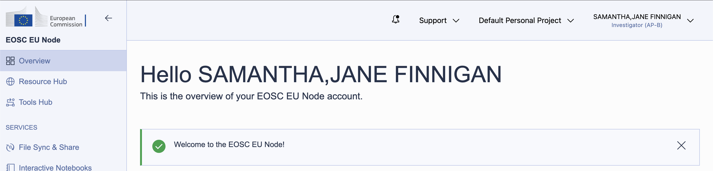

Resources on the EOSC EU Node are managed through *group projects*. A default personal project exists for every user, but to share resources (and the credits that fund them) with colleagues, create a group project. This also allows collaborators to be invited to the shared environment.

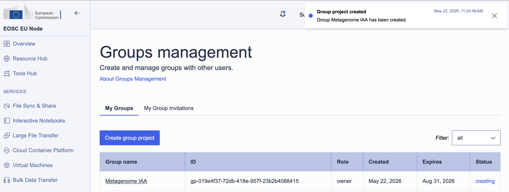

Resource allocation uses a *credits* system: different services and VM sizes draw credits at different rates per day. Group projects are allocated up to 6,000 credits, refreshed over a 90-day window.


## Allocating a virtual machine

With the group project in place, order a VM through the **Virtual Machines** service. The EOSC EU Node offers several flavours: for a shared JupyterHub, the **Medium** tier (16 vCPUs, 64 GB RAM) at 40 credits per day is a reasonable starting point. Over the 90-day maximum period that comes to 3,600 credits, well within a group allocation.

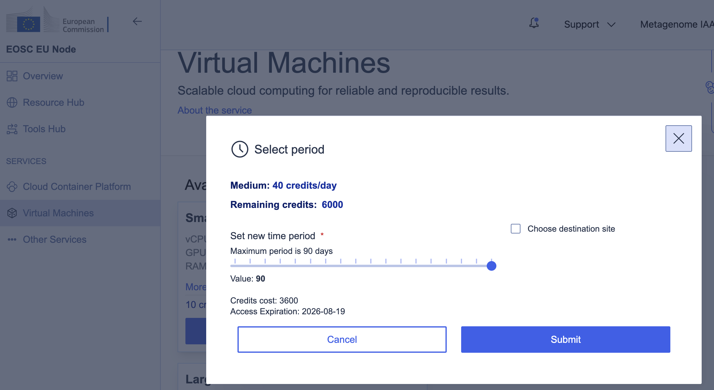

Once the order was submitted, resource allocation took only a couple of minutes. The environment appeared as **Active** in the portal, and clicking **View Externally** opened the OpenStack Horizon dashboard for our project, managed by PSNC (the Poznań Supercomputing and Networking Center).

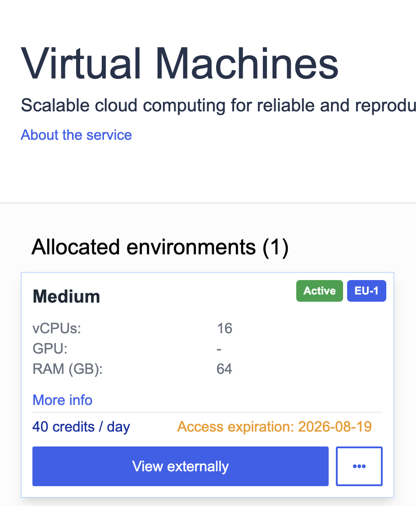

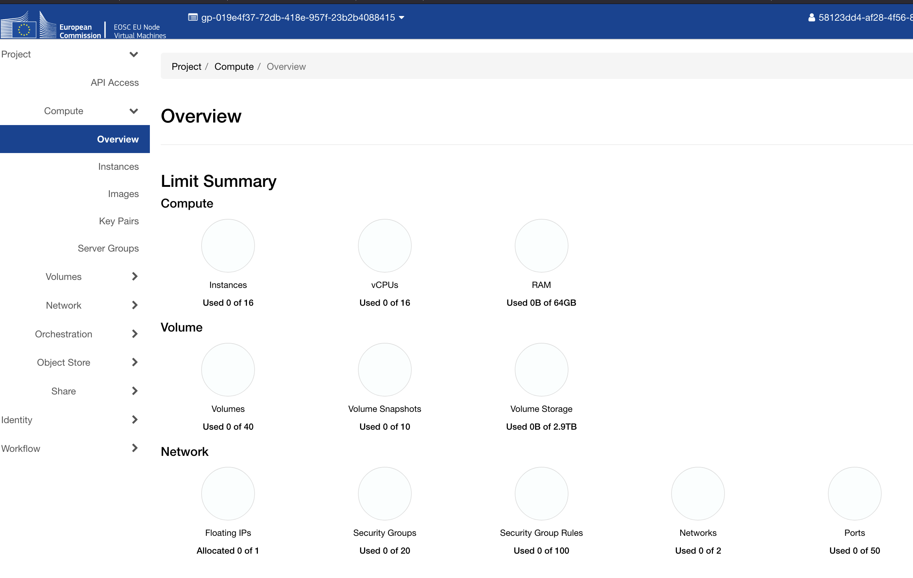

## Navigating the network

This is where things got interesting. In OpenStack, the most natural expectation would be to attach a public network directly to an instance — but PSNC's external network, `PSNC-EXT-PUB1-EDU`, is a *gateway* network. Instances cannot be attached to it directly; instead, it must be used as the upstream gateway of a router, which connects to a private tenant network. Public access is then handled via *floating IPs*, which are drawn from the external pool and associated with specific instance ports.

This is a common enough pattern in OpenStack deployments, but it adds several setup steps that aren't obvious from the Horizon interface alone.

### Private network and subnet

Create a private network with a subnet: we used `10.10.40.0/24`. Enable DHCP, and set DNS resolvers at the subnet level; Cloudflare's public resolvers (`1.1.1.1` / `1.0.0.1`) work well here.

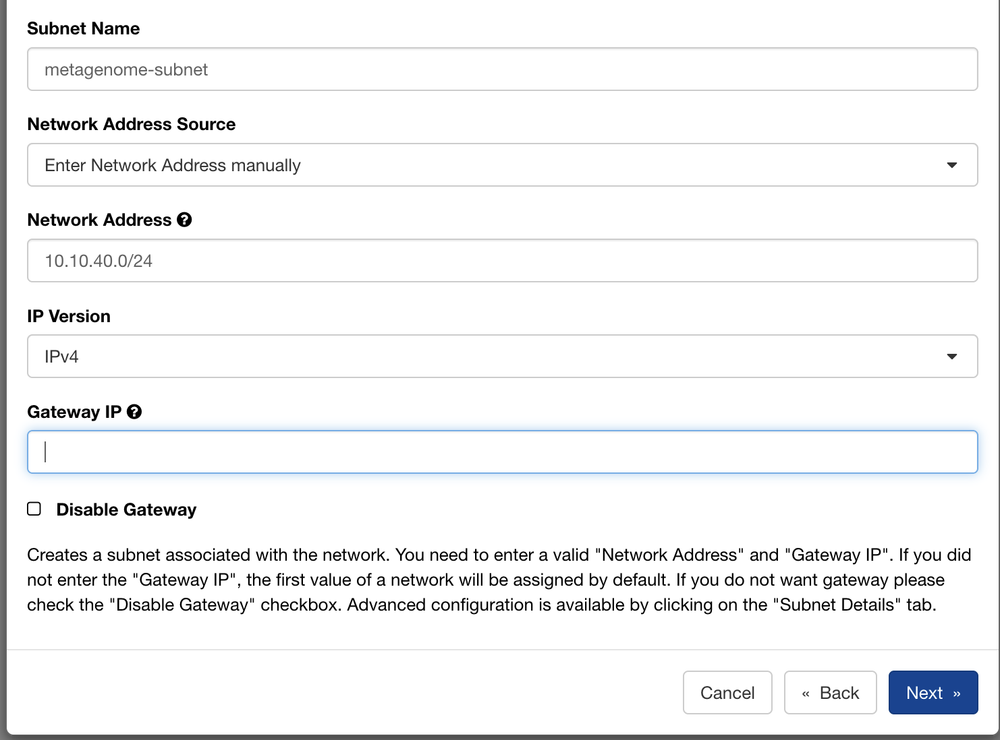


### Router

Create a router with `PSNC-EXT-PUB1-EDU` as its external gateway, then attach the private subnet as an internal interface. This gives instances on the `10.10.40.0/24` network a route to the internet via the PSNC gateway.

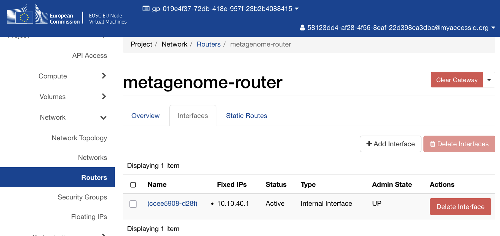

## Launching the instance

With the network in place, launch an instance with the following configuration (we named ours **Metagenome-JH**):

- **Image:** `ubuntu-24.04` (the standard Ubuntu 24.04 LTS cloud image)
- **Flavour:** `C1-NVME-16vCPU-64R-100D` (16 vCPUs, 64 GB RAM, 100 GB NVMe root disk)
- **Network:** your private tenant network
- **Key pair:** your SSH public key, imported via the Horizon interface

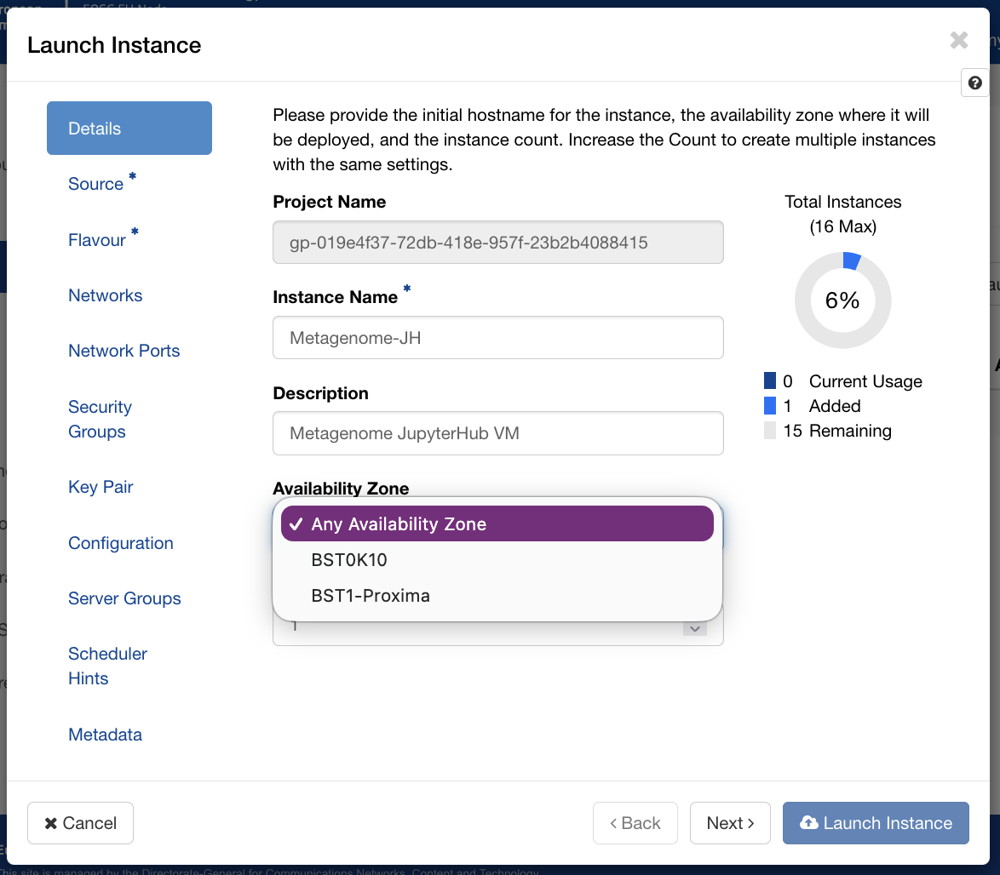

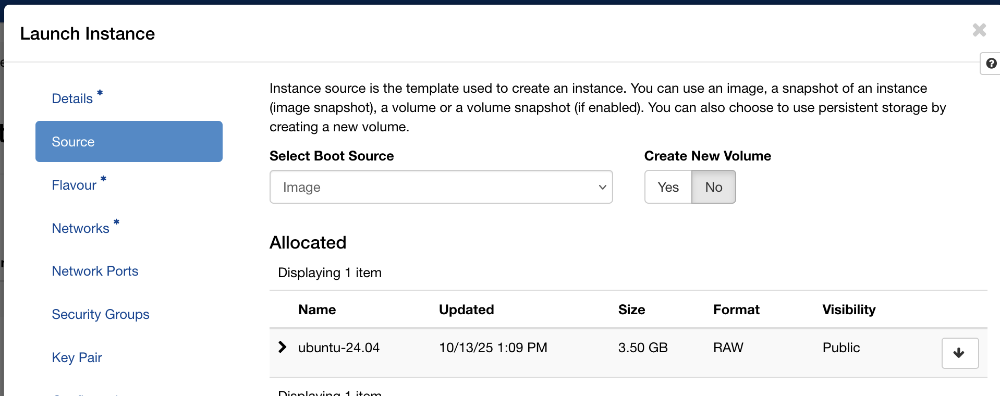

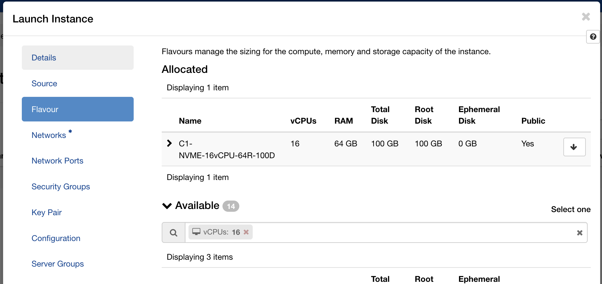

Within a minute the instance appeared in the instances list with status **Active** and power state **Running**.

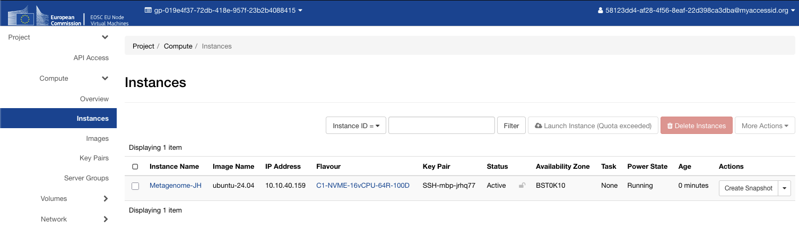

## Floating IP and security groups

The instance gets a private IP on your tenant network. To reach it from the internet, allocate a floating IP from the `PSNC-EXT-PUB1-EDU` pool (the project quota allows one) and associate it with the instance.

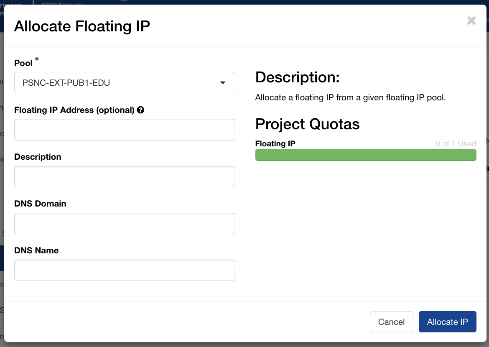

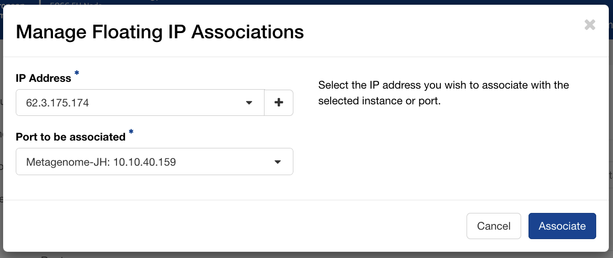

PSNC automatically assigns reverse DNS entries for floating IPs in their pool. A quick `nslookup` confirmed that `62.x.x.x` resolved to `hostname-xxx.man.poznan.pl`, a hostname we could use directly for the Let's Encrypt certificate without needing to configure any external DNS ourselves.

```
$ nslookup 62.x.x.x
Non-authoritative answer:
x.x.x.62.in-addr.arpa  name = hostname-xxx.man.poznan.pl
```

Create a security group with ingress rules for the ports you need:

| Protocol | Port | Purpose |
|----------|------|---------|
| TCP | 22 | SSH access |
| TCP | 80 | HTTP (Let's Encrypt ACME challenge) |
| TCP | 443 | HTTPS (JupyterHub via nginx) |
| TCP | 8000 | Direct JupyterHub access during testing |
| ICMP | — | Ping / diagnostics |

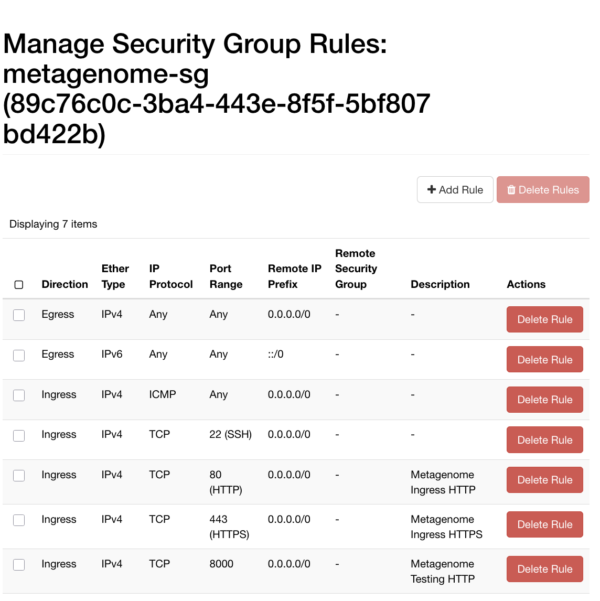

With the floating IP associated and the security group attached, the first SSH connection confirmed the instance was reachable:

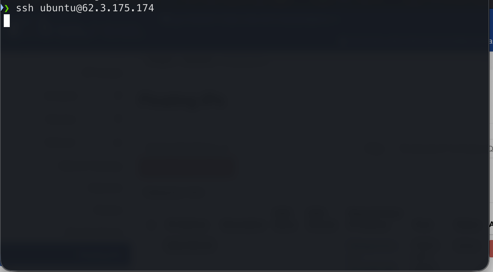

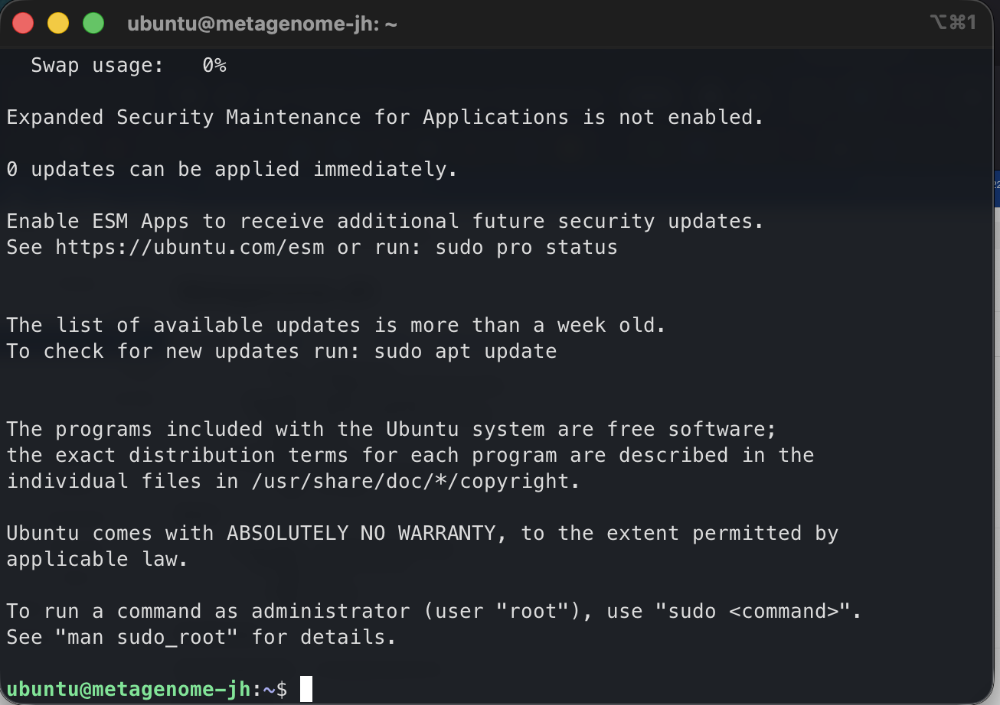

## Automating the deployment with Ansible

Getting a VM running is the beginning, not the end. The harder question is: what happens when the instance needs to be rebuilt, when a colleague needs to reproduce the environment, or when we want to apply the same setup to a different project? Clicking through Horizon is fine once; doing it repeatedly, reliably, and without forgetting steps is a different matter.

For this reason we wrote an Ansible playbook to codify the entire server configuration. Ansible is an automation tool that describes the desired state of a system as YAML and applies that state idempotently: running it twice leaves the server in the same condition as running it once. The playbook is organised into *roles*, each responsible for one logical concern.

### What the playbook does

**`users`** ensures the default `ubuntu` cloud user is in the `docker` group, and optionally installs authorised SSH keys. On Ubuntu 24.04 cloud images the user already exists; this role adjusts its configuration rather than creating it from scratch.

**`system`** upgrades all packages on first run and installs Docker CE along with the Compose plugin, using Docker's official APT repository. We chose Docker rather than a system package because the Docker project's own packages track upstream more closely and include the Compose v2 plugin that the JupyterHub role depends on.

**`security`** installs and configures fail2ban with an aggressive SSH jail (three failed attempts within a minute earns a 60-minute ban) and hardens the SSH daemon by disabling root login and password authentication. Only key-based SSH access is permitted. The role validates the SSH daemon configuration with `sshd -T` before triggering a restart, so a misconfiguration fails loudly rather than silently locking us out.

**`nginx`** installs nginx and certbot, then uses certbot's `--webroot` mode to obtain a Let's Encrypt TLS certificate for the server's domain name. We deliberately chose `certonly --webroot` over `certbot --nginx` after an initial attempt with the latter caused problems: `certbot --nginx` modifies the nginx configuration file in place, but Ansible's template task then overwrites those modifications on subsequent runs, resulting in a server that had a valid certificate on disk but no HTTPS configuration active. Separating the two concerns (certbot handles certificate issuance only; Ansible templates handle the full nginx configuration including the SSL server block) gave us clean, fully idempotent behaviour.

**`jupyterhub`** is the heart of the deployment. JupyterHub runs in a Docker container built from a small `Dockerfile` that extends the official `quay.io/jupyterhub/jupyterhub` image with two additions: [DockerSpawner](https://github.com/jupyterhub/dockerspawner), which lets the hub start and stop per-user containers, and [NativeAuthenticator](https://github.com/jupyterhub/nativeauthenticator), which manages user accounts and passwords locally without requiring an external identity provider.

The hub container is managed by Docker Compose. It binds to `127.0.0.1:8000` only (nginx handles all public traffic) and has read-only access to the Docker socket so it can spawn user containers. Each user's container runs the `quay.io/jupyter/datascience-notebook` image, which provides Python, R, and Julia kernels with a broad scientific stack out of the box. User working directories persist in named Docker volumes, so notebooks survive container restarts.

### Challenges along the way

**Docker network label conflict.** Our first attempt pre-created the Docker network using Ansible's `docker_network` module, then had Docker Compose reference it. Docker Compose refused: it found an existing network with the right name but without the labels it expects to manage. The fix was straightforward: remove the pre-creation task and let Compose own the network entirely. Running `docker network rm` to clear the orphaned network on the server unblocked things immediately.

**The nginx/certbot config conflict.** As mentioned above, using `certbot --nginx` creates a fight between certbot's in-place edits and Ansible's template deployments. Every time the playbook ran, Ansible would restore the HTTP-only template, and since the certificate already existed, certbot's task was skipped, leaving 443 inactive. Switching to `certbot certonly --webroot` and managing the complete nginx configuration (both the HTTP redirect and the HTTPS proxy blocks) as a single Ansible template resolved this permanently.

**The NativeAuthenticator bootstrap problem.** NativeAuthenticator with `open_signup = False` requires an administrator to approve accounts before users can log in. But the first administrator account has nobody to approve it. Signing up as `admin` and immediately trying to log in produced only "Invalid username or password", a misleading error that obscures the real issue: the account exists but is not yet authorised. The resolution is to add the admin username to `allowed_users` in the JupyterHub configuration, which grants that specific account immediate login rights after signup without requiring external approval.

**Swap file sizing.** Our swap role would have created a swap file matching the system's RAM (a reasonable default on memory-constrained servers, but a poor choice here). With 64 GB of RAM on a 100 GB root disk, a same-size swap file would consume almost two-thirds of available storage. We excluded the swap role from the playbook entirely for this deployment; it remains available in the codebase for use on smaller instances where it makes more sense.

### What reproducibility buys you

By the time all the above was working, re-running the full playbook against the server produced no changes. Idempotence is the point: the playbook is a specification, not a sequence of commands. If we need to rebuild the server (because the EOSC VM allocation expires, because we want to move to a larger flavour, or because something goes wrong) we can do so with a single command and have confidence the result will match what we have today. We also have a `redeploy-jupyterhub.yml` playbook for day-two operations: rebuilding the hub container after config changes, or wiping the user database entirely when needed (useful during initial setup when you manage to lock yourself out).

## The result

JupyterHub is now running on our cloud server, served over HTTPS with a valid Let's Encrypt certificate, on infrastructure funded by the EOSC EU Node. Researchers can log in, create accounts, and start notebook servers immediately, each getting a full data science environment without any local installation.

For arts and humanities researchers, access to a shared, managed JupyterHub like this changes what is practically achievable in a project. Computational methods that require consistent software environments (training a machine learning model on a digitised text collection, running Named Entity Recognition across a large corpus, processing geospatial data from fieldwork, or simply sharing analysis code with a supervisor or external collaborator) become straightforwardly accessible. The EOSC EU Node provides the compute; Ansible ensures it can be reliably rebuilt; and JupyterHub puts it in front of researchers through nothing more than a web browser.

From a CCP-AHC perspective, this is a practical demonstration of the kind of infrastructure we are working to make more accessible to the arts, humanities, and cultural heritage community: reproducibly configured, hosted on European open science resources available to any EU-affiliated researcher, and designed to be adapted and reused rather than rebuilt from scratch for each new project.

---

*The EOSC EU Node is operated by the European Commission. Virtual machine resources at PSNC were accessed via the EOSC EU Node Virtual Machines service.*
